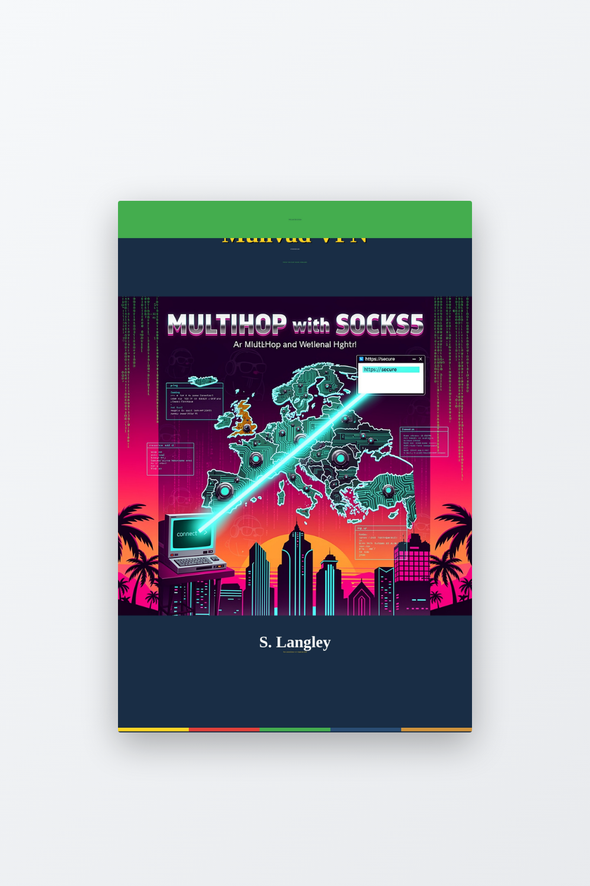
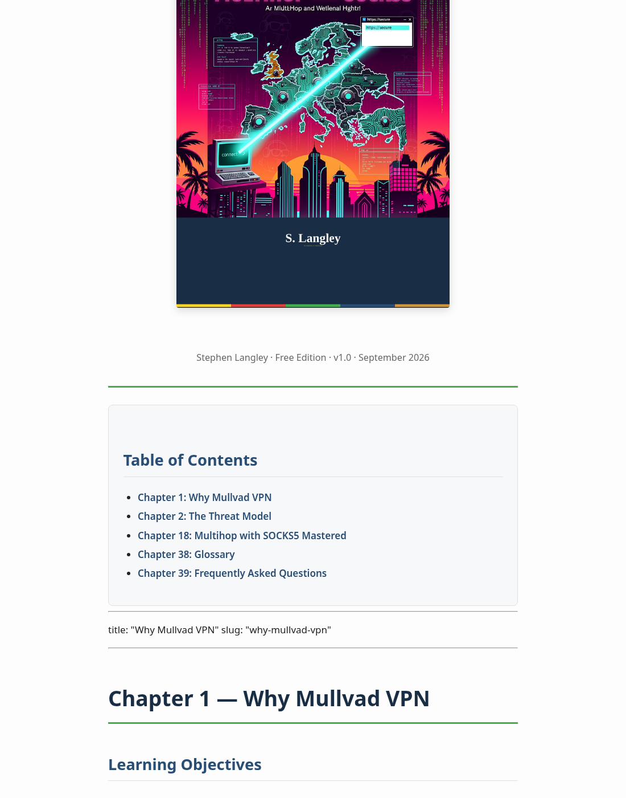
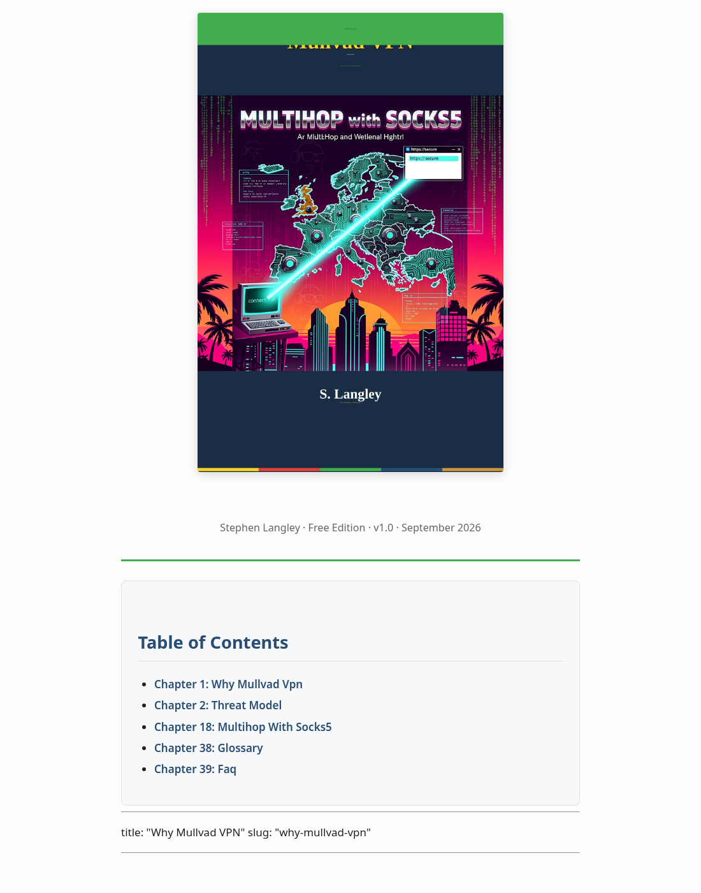

# Mullvad VPN — A Practical Guide

> **Privacy is for the people.** The Free Limited Edition of a 40-chapter technical reference on Mullvad VPN, published openly. The full edition (40 chapters, all formats) is sold commercially across 11 markets.

This repository hosts the **Free Limited Edition** of *Mullvad VPN — A Practical Guide to Privacy, Multihop, and the SOCKS5 Multihop Workflow*. The free edition contains 5 chapters:

1. **Why Mullvad VPN** — mission, ownership, history
2. **The threat model** — what VPNs can and cannot protect
3. **Multihop with SOCKS5 Mastered?** *(the showcase chapter)* — SOCKS5 multihop architecture, hands-on Firefox/Chrome walkthrough, security caveats
4. **Glossary** — every VPN + Mullvad-specific term you'll encounter
5. **FAQ** — the 20 most common questions, sourced from Mullvad's official help center

The Free Limited Edition is released under **CC BY-NC-SA 4.0**. You may read, share, and remix it non-commercially. For the full 40-chapter edition (35 additional chapters covering WireGuard internals, DAITA, Mullvad Browser, CLI, router deployment, PGP support, performance tuning, and more), see the buy links at the bottom of this README.

---

## What's inside

### Sample: The showcase chapter (Multihop with SOCKS5 Mastered)

This is the centerpiece of the book — the architecture that lets your browser exit through a different country than the WireGuard tunnel you connected through. The screenshot below shows the 90s-style tutorial walkthrough in action.

### Sample: QR codes for every cited URL

Every URL cited in the book is encoded as a brand-styled QR code (using `segno` with ECC H, Mullvad brand palette). Inline for the most critical links, plus an appendix-grid per chapter.

---

## Reading the book

The easiest way to read is **right here in the browser** — the entire book is rendered as a single HTML page below. Click any chapter link in the table of contents.

For offline reading, download the EPUB or PDF:

- 📥 **EPUB3:** [`downloads/mullvad-vpn-ebook-free.epub`](downloads/mullvad-vpn-ebook-free.epub) — 1.9 MB
- 📥 **PDF:** [`downloads/mullvad-vpn-ebook-free.pdf`](downloads/mullvad-vpn-ebook-free.pdf) — 2.2 MB

Both files are built automatically from the same Markdown source. The book is generated by a pure-Python pipeline (no Pandoc, no LaTeX) — see the source repository for details.

---

## Build quality

| Aspect | Detail |
|---|---|
| **Manuscript** | 5 chapters (free) · 7,306 words · 96,487 total in the full edition |
| **Covers** | 3000×4500 print master + 18 per-market variants, brand-styled (Mullvad palette) |
| **QR codes** | `segno` ECC H, rounded modules, Mullvad red `#E34039` on dark-blue `#192E45` |
| **Diagrams** | 5 SVG diagrams (multihop, SOCKS5 endpoints, network, kill switch, comparison) |
| **Voice** | 90s-tutorial style for walkthroughs; technical prose for concepts |
| **Pipeline** | Python 3.11+ (segno, ebooklib, python-docx, playwright, pyyaml) |
| **Build time** | ~30 seconds end-to-end |
| **C1 memory** | 158 active memories, 294 cross-refs, faceted in Meilisearch |

---

## What you get in the **Full Edition** (40 chapters)

The 35 additional chapters cover:

- **Part I — Foundations** — the account model (anonymous by design), choosing your platform
- **Part II — Installation** — macOS, Windows, Linux (GUI + CLI + bare WireGuard), iOS, Android
- **Part III — Server Network** — 553 relays, naming convention, choosing a server
- **Part IV — WireGuard + SOCKS5 Internals** — architecture, `multihop_port`, the `10.64.0.1` and `10.124.0.0/16` networks, SOCKS5 listener behavior
- **Part V — Multihop** — Multihop with WireGuard (end-to-end encrypted), the 2026 redesign (When-needed / Always / Automatic / Never modes), choosing the right configuration
- **Part VI — Censorship & Advanced Routing** — Bridge mode + Shadowsocks, split tunneling, DAITA traffic-analysis defense
- **Part VII — Privacy Hardening** — kill switch, DNS leak protection, port forwarding, Mullvad Browser, custom DNS
- **Part VIII — Power User** — Mullvad CLI complete reference, WireGuard config generator, router deployment (OpenWrt + pfSense), multi-device + family use
- **Part IX — Operations** — performance tuning, logs + diagnostics, PGP-encrypted support workflow
- **Part X — Business + Community** — pricing, refunds, reseller program, careers, open source
- **Part XI — Reference** — extended glossary, FAQ, full QR-grid references, about, contact, colophon

**Plus** every chapter has the same Full Stack template:

- **Part A** — Detailed information (verbatim Mullvad quotes, architecture, specifications, caveats)
- **Part B** — A 90s-style hands-on tutorial walkthrough ("Now, you do it!") with What-You'll-Need, numbered steps, Tips + Gotchas, a Summary table, and Exercises
- **Part C** — Platform-specific notes for macOS / Windows / Linux / iOS / Android / Router
- **Part D** — References with QR codes for every URL
- **Closing encouragement** — a 1-paragraph wrap-up

---

## Buy the full edition

The full 40-chapter edition (paid, all formats) is available across **11 markets** at **$9.99 USD / €9.99 / £7.99**:

| Store | Link | Format |
|---|---|---|
| **Amazon Kindle** | [amazon.com/dp/ASIN](https://www.amazon.com/dp/) | Kindle (MOBI/AZW3) + Paperback |
| **Apple Books** | [books.apple.com](https://books.apple.com/) | EPUB3 |
| **Kobo** | [kobo.com](https://www.kobo.com/) | EPUB |
| **Google Play Books** | [play.google.com/books](https://play.google.com/books) | EPUB |
| **Samsung Books** *(via Draft2Digital)* | [draft2digital.com](https://www.draft2digital.com/) | EPUB |
| **Gumroad** | [stephenlangley.gumroad.com/l/mullvad-full](https://stephenlangley.gumroad.com/l/mullvad-full) | EPUB + PDF + MOBI bundle |
| **Leanpub** | [leanpub.com/mullvad-vpn](https://leanpub.com/mullvad-vpn) | EPUB + PDF + MOBI |
| **Smashwords / Draft2Digital** | [smashwords.com](https://www.smashwords.com/) | EPUB → 7+ markets |
| **Lulu** *(paperback + hardcover)* | [lulu.com/spot/stephenlangley](https://www.lulu.com/spot/stephenlangley/) | Print PDF |
| **itch.io** | [stephenlangley.itch.io/mullvad-vpn](https://stephenlangley.itch.io/mullvad-vpn) | EPUB + PDF (PWYW) |
| **GitHub Pages** *(free edition)* | This repository | HTML + PDF + EPUB downloads |

---

## About the author

**S. Langley** (Stephen Langley) is a privacy-focused developer and writer. This book is the result of independent research into Mullvad VPN's official documentation and live infrastructure as of September 2026. The author has no affiliation with Mullvad VPN AB.

## No endorsement

This book is **not affiliated with, endorsed by, sponsored by, or reviewed by** Mullvad VPN AB. "Mullvad" is a trademark of Mullvad VPN AB. The "Mullvad" wordmark and logo are used in this book under the editorial usage guidelines published at <https://mullvad.net/en/press/>. All trademarks are the property of their respective owners.

The cover design is the author's original artwork, using Mullvad's published brand palette (`#192E45`, `#294D73`, `#44AD4D`, `#E34039`, `#FFD524`, `#D2943B`, `#FFCD86`) but **not** the Mullvad logo or wordmark. No permission from `press@mullvad.net` is required for this design.

## Trademark note for store listings

When uploading the book to commercial stores, please include this notice in your book's "Editorial Review" or "Description" section:

> Mullvad® is a trademark of Mullvad VPN AB. Used here under editorial guidelines published at https://mullvad.net/en/press/. WireGuard® is a registered trademark of Jason A. Donenfeld.

---

## License

**The Free Limited Edition** is licensed under the **Creative Commons Attribution-NonCommercial-ShareAlike 4.0 International License** ([CC BY-NC-SA 4.0](https://creativecommons.org/licenses/by-nc-sa/4.0/)).

You are free to:
- **Share** — copy and redistribute the material in any medium or format
- **Adapt** — remix, transform, and build upon the material

Under the following terms:
- **Attribution** — You must give appropriate credit, provide a link to the license, and indicate if changes were made.
- **NonCommercial** — You may not use the material for commercial purposes.
- **ShareAlike** — If you remix, transform, or build upon the material, you must distribute your contributions under the same license as the original.

**The Full Edition** is **All Rights Reserved**. The author retains exclusive commercial distribution rights.

© 2026 S. Langley (Stephen Langley). All rights reserved (Full Edition).